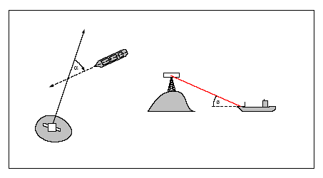
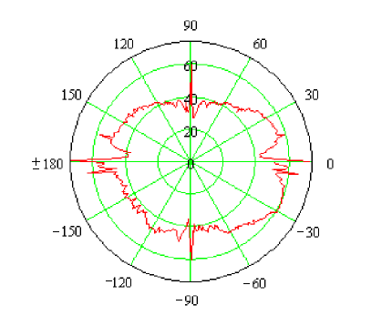
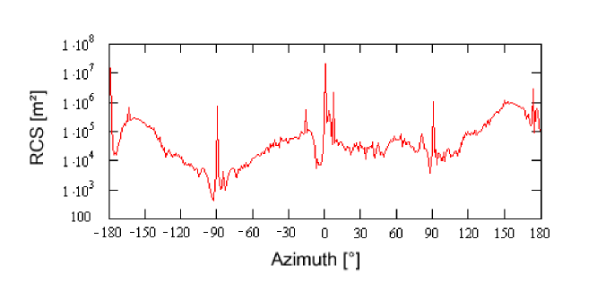
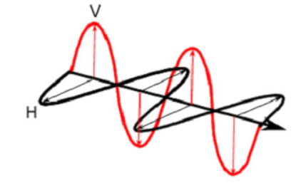

== Radar Cross Section Models

For devices such as Radar, a geometric representation of a model may often provide a level of fidelity which is insufficient or inappropriate for use in simulation. Alternately, it may not be feasible to compute a radar cross-section of the model in real-time. Further, a user may wish to incorporate real-world RCS data into the simulator client-devices in order to further improve simulation fidelity. To this end, this document defines a RCS (Radar Cross-Section) model representation for use by Sensor Simulation client-devices such as Radar and/or Sonar. This model provides a signature model representing the overall relative reflectivity levels of a given Model Representation when viewed at discrete azimuth and elevation angles. The RCS data is then used in range and aspect calculations for the detection and classification of simulated targets (either ground or moving).

The following Section 6 Clauses provide a primer on radar, basic principles of operation and radar cross sections (RCS).

The Radar Cross-Section (RCS) of a target is a measure of the radar reflection characteristics of a target (usually expressed in m^2^, dBsm, or volts). It is equal to the power reflected back to the radar divided by power density of the wave striking the target. For most targets, the radar cross-section corresponds to the area of the cross section of the sphere that would reflect the same energy back to the radar, if a metal sphere were substituted. A sphere is sometimes used since the RCS of a sphere is independent of frequency if operating in the far field region of the radar (Reference <<R24>>).

The RCS data unit of measure for the intensity are usually referenced as a normalized ratio in Decibels relative to a square meter (reference <<R25>>), or otherwise known as dBsm. Another data measure that is linked to the intensity measure is also the ‘phase shift’ angle (in degrees) of the returned energy. It can provide some additional information about the reflective attributes of the elements reflecting back to the radar.

However, the RCS defines the echo at the radar for the model (target) in question, which varies considerably depending on the target’s orientation, its relative distance and size with respect to the simulated radar’s antenna. The viewing angles are shown in the diagram below.

[#img_RelativeAzimuthElevationAngles,reftext='Figure A-19']
*Figure A-19: Relative Azimuth (α) and Elevation (φ) Angles*

RCS curves are normally produced using highly specialized off-line tools which input the model geometry and material attributes (typically an OpenFlight file) and applies physics-based processing like geometric ray-tracing, optical reflections/refractions, corner detection, material absorption and so on to the geometric data representation of the model. This processing is computationally expensive and is usually performed in non real-time. The end-result of this computation (usually 2D arrays of data points in elevation and azimuth) provides data that can be used more efficiently by simulation modeling such as radar at run-time. Those data curves are stored in a polar-type representation table, which provide specific reflectivity levels given a set of azimuth and elevation aspect angles.

=== Functional Description

To simulate a target for most modes of operation, the Radar software uses an RCS Polar Diagram as shown below:

[#img_PolarDiagramRCSDataDecibelsGivenElevationAngle,reftext='Figure A-20']
*Figure A-20: Polar Diagram of RCS data in Decibels at a given elevation angle*

The polar diagram allows the radar to use an RCS value array (indexed by azimuth/elevation angles) for getting an approximation of the overall RCS of distant targets. The approximated RCS data is a function of the model’s materials, geometry, view angles, and multi-paths reflections generated within the model itself.

RCS data can also be depicted more linearly as shown in the following diagram:

[#img_LinearDiagramOfRCSDataInDecibelsAtAGivenElevationAngle,reftext='Figure A-21']
*Figure A-21: Linear Diagram of RCS data in Decibels at a given elevation angle*

As can be seen in the example above, relative intensities are much greater when viewing the model directly in front (0° azimuth), from the back (±180° azimuth) and on the sides (-90° and +90° azimuth).

The RCS data is often characterized by its data resolution and physical modeling parameters. The data resolution determines the angular increments between successive RCS values, and modeling parameters specify the attributes of the physical parameters used to drive the RCS mathematical model computations (such as the Electro-Magnetic properties of the simulated electric field).

Both wavelength and polarization affect how a radar system “sees” the elements in the scene. Therefore, radar using different polarization and wavelength combinations may provide different and complementary information, which can be used to enhance the radar image in a specific way.

=== Wave Polarization

When computing an RCS model, it is important to consider microwave energy propagation and scattering, and also the polarization of the radiation, which is an important property. For a plane electromagnetic (EM) wave, polarization refers to the locus of the electric field vector in the plane perpendicular to the direction of propagation. The length of the vector represents the amplitude of the wave, and the rotation rate of the vector represents the frequency of the wave. Polarization refers to the orientation and shape of the pattern traced by the tip of the vector (Reference <<R23>>).

[#img_HorizontalAndVerticalPolarizationOfAPlaneOfEMWave,reftext='Figure A-22']
*Figure A-22: Horizontal and Vertical Polarization of a plane of EM wave*

The waveform of the electric field strength (voltage) of an EM wave can be predictable (the wave is polarized) or random (the wave is un-polarized), or a combination of both. In the latter case, the degree of polarization describes the ratio of polarized power to total power of the wave. An example of a fully polarized wave would be a monochromatic sine wave, with a single, constant frequency and stable amplitude.

Many types of radar antennae are designed to transmit and/or receive microwave radiation that is either horizontally (H) or vertically (V) polarized, or a combination of both. A transmitted wave of either polarization can generate a backscattered wave with a variety of polarizations, thus an equal amount of resulting RCS curves.

Polarization type on either transmission or reception mode can be synthesized by using H and V components, with a well-defined relationship between them. For this reason, systems that transmit and receive both of these linear polarizations are commonly used. With these radars, there can be four combinations of transmit and receive polarizations:

* HH - for horizontal transmit and horizontal receive
* VV - for vertical transmit and vertical receive
* HV - for horizontal transmit and vertical receive, and
* VH - for vertical transmit and horizontal receive.

The first two polarization combinations are referred to as “like-polarized” because transmit and receive polarization types are the same. The last two combinations are referred to as “cross-polarized” because transmit and receive polarizations are orthogonal to one another.

Radar systems can have one, two, or all four of these transmit/receive polarization combinations. Examples include the following types of radar systems:

* Single polarized: HH or VV (or possibly HV or VH)
* Dual polarized: HH and HV, VV and VH, or HH and VV
* Alternating polarization: HH and HV, alternating with VV and VH
* Polarimetric: HH, VV, HV, and VH

Both wavelength and polarization affect how a radar system “sees” the elements in the scene. Therefore, radar using different polarization and wavelength combinations may provide different and complementary information, which can be used to enhance the radar image in a specific way.

Therefore, polarization information is an important part of the CDB’s RCS Data representation.

=== Wave Parameters

In addition to the wave polarization explained above, other physical parameters of the modeled electromagnetic wave are also a contributing factor to the RCS of a target when seen by Radar. Therefore those parameters are available in conjunction with the RCS data curves:

Those parameters are generally as follows:

* Radar Mode (Continuous wave or Pulsed)
* Radiating Frequency
* Antenna Main Lobe Gain
* Antenna Main Lobe Bandwidth
* Antenna Side Lobe 3dB point
* Radar Pulse width (if pulsed radar mode)
* Radar Pulse Repetition Frequency (if pulsed radar mode)
